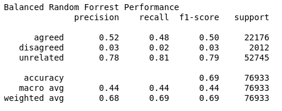

# Project II - Fake News Classification

This project focused on being able to classify news article titles based on whether they agreed, disagreed, or where unrelated to a given news article title. This is an important way to identify how fake news spreads and whether or not subsequent articles are agreeing with a fake news article. 

		
Each row of the data that was given included a "title1" and "title2" text as well as a "label" identifying the relationship between the two articles. This type of input is exactly what is needed to create a supervised learning model that can complete classification tasks.
		
## Pre-processing
		
Before being able to train a classification model, input data must be pre-processed to get it ready to feed into a classifier. In this case pre-processing included importing the data, cleaning it, doing exploratory data analysis, and then pre-processing the format of the data to be fed into the classifier.
		
## Data Cleaning
		
Cleaning the data began with removing upper case letters upon import of the data, followed by removing punctuation, and numerical digits. These adjustments are helpful to standardize the data and remove numbers or punctuation that make tokenization harder. Another removal technique is to remove stopwords. This was done as taking out common words like "the," "and," "is" helps to make sure that only significant words remain in each document. Removing these unimportant words makes sure that if two documents have high similarity, it is because their content is similar, not because they used many of the same relatively meaningless words.

## Tokenization and Lemmatization

Another important step of data pre-processing is tokenization, which splits a document into smaller units called tokens. In this case, each token is one word. Having data in this form allows for the creation of a document-term matrix or to TFIDF matrix. More on that later! Once words were tokenized, then lemmatization was applied to reduce each word to its root word form. This is helpful to standardize the data and make sure that words like "walking" and "walk" are treated as meaning the same thing. This is another helpful way to make sure similarity scores reflect the meaning of the document.
		
## Exploratory Data Analysis
		
Once data was cleaned, a quick exploratory data analysis (EDA) was performed. Understanding how many instances of each label was important to see if the data is balanced and to understand how imbalances will affect the model. Also, visualizing common words for each label was done to see if there was a pattern to words used in the different categories.
		
## Data Formatting
		
After this exploration, final pre-processing of formatting the data into a matrix was necessary to be able to convert the text data into numbers the computer can understand. First every document (in this case every cleaned title in the trianing data) was added to the corpus and then vectorized into a sparse matrix that represents which words appear in which documents. This vector was fit and transformed into a TFIDF matrix, which stands for term frequency inverse document frequency matrix. Instead of simply rating how many time a word appears in a document, TFIDF allows words to be weighted based on their frequency across all texts. For example, if a word appears across all documents, it doesn't help to better classify and distinguish between the documents, so that word is given a lower score. A word that only appears in one document may be very helpful in determining the meaning of that text and distinguishing it from others.
		
Using the data in the TFIDF, it was possible to compute the cosine similarity of "title1" and "title2" for each row/document in the corpus. This information was added to a new dataframe which is used as input to the model. In addition to cosine similarity, I also ran sentiment analysis on the titles to identify the polarity and subjectivity of each title. These scores were added to the new dataframe. The resulting dataframe contains cosine similarity, polarity for each title, and subjectivity for each title.
 
## Model

The newly created dataframe mentioned above was used as input for the models. Since there was so much data and it was a multiclass classification problem, I chose to begin with a decision tree classifier called Random Forest. The data set is also highly unbalanced so I attempted a run of the model with balanced data. Both of these attempts were not promising, so I moved on to try a different classifier.
		
Even though the data is multi-class, in most of the classifiers I tried, I also ran a binary version just to see and analyze the performance improvement of running a multi-class version. This allowed me to see if one classier performed better on such a highly unbalanced data set.
		
Naive Bayes is a common classifier for natural language processing tasks since it works with prior probability to determine the likelihood of a subsequent word. It also assumes independence of words, which is not the best option for sentence sequences, but I wanted to try it out nonetheless. I gave it a try and quickly saw that it wasn't a viable option.
		
After further contemplation of the problem, I considered logistic regression as a viable option due to its ability to classify categorical data well. After a few iterations of the model and after testing it out for multinomial multi-class classification as well as determining whether to used balanced, weighted, or unbalanced data, I arrived at the final classifier.
		
Ultimately I chose to use a balanced multinomial logistic regression classifier. This classifier accounts for the and adjusts to better predict on the unbalanced data.
		
		
## Validation

As mentioned above, several different classifiers and ML models were created attempting to improve the results. I have included the performance metrics for each model I tried. For the purposes of validation, I chose to prioritize the F1 score since this does a better job evaluating an unbalanced dataset.
		
## Random Forest
		
The basic Random Forest model is the first classifier I tried. It did well identifying unrelated, but that is to be expected since the majority of the training data was of the "unrelated" class. This model did not do well with the agreed or disagreed as can be seen below.
		

	
After seeing the above results, I gave Random Forest one more try by balancing out the data. Unfortunately, this did not have an impact on the results. Thus, I chose to attempt another classifier.
		

## Gaussian Naive Bayes
		
Even though Gaussian Naive Bayes is intended for a binary classifier, the poor results from Random Forest made me interested in seeing how a classifier like Naive Bayes does since the input data is so unbalanced.
		
Although the F1 score for "agreed" and "unrelated" classes increased to 0.53 and 0.84 respectively, the model didn't predict any disagreed classes, which is not a beneficial model in this case.

	
	
	
## Logistic Regression
		
After trying the above models, I did more research and felt that Logistic Regression would be a better predictor, or at least worth a try. Again, I started with the unbalanced, binary logistic regression model to get a baseline to which I could compare the performance of later iterations of the model.	

	
	
The above first pass shows that the F1 score for agreed is slightly better than the other models, but again, it isn't detecting "disagreed" classes. Thus I tried the Multinomial Logistic Regression to better deal with the multi-class input data. Below are the results.

	
		
Surprisingly, there was no change in the results even when accounting for multiple classes. However, since this classifier was still performing the best so far, I continued to tweak it to see what improvements could be made, especially to the "disagreed" detection.
		
The next iteration used Balanced Multinomial Logistic Regression to counteract the uneven input data. As seen below, the F1 score for "agreed" and "disagreed" classes improved to 0.58 and 0.06 respectively. This is the best performance of all the classifiers for these two classes.

	
		
The improvement in the results was encouraging, but I still hoped to get the model to perform better. After some research, I found a way to weight the classifier to proportionally favor the less represented classes. The below results show that this did not benefit the classifier.

	
			
The F1 score for the "agreed" class with weighted Multinomial Logistic Regression classifier was very bad at a score of 0.37. The "disagreed" class again had a score of 0.0 and only the "unrelated" class improved.
		
These results led me to revert back to the Balanced Multinomial Logistic Regression Classifier. While its weighted average score for F1 was 0.71 (0.02 points below that of the highest weighted average score), it performed the best at identifying the "agreed" and "disagreed" classes with scores of 0.58 and 0.06 respectively. Because of this last fact, I chose to use this model because it was able to identify all three classes and did the best job at identifying the hardest class to identify ("disagreed" class).
		
## Conclusion
		
This exploration and analysis showed that using a multi-class classifier does perform differently than a binary one. This point is obvious to some, but is worth exploring and seeing first hand in a learning environment like this. Additionally, I found that a Logistic Regression classifier performed the best out of all the classifiers tested. Accounting for data imbalances was important in improving the classifier, but contrary to what I expected weighting a classifier to favor one class over another did not perform as well. There may be instances when this is beneficial, but as seen in this exploration, a simple balanced data input improved the classifier the best.
		
## Reference

Websites used to troubleshoot:

[https://datapeaker.com/big-data/apoyar-el-algoritmo-de-maquina-vectorial-en-el-aprendizaje-automatico/](https://datapeaker.com/big-data/apoyar-el-algoritmo-de-maquina-vectorial-en-el-aprendizaje-automatico/)

[https://koalatea.io/multiclass-logistic-regression-sklearn/](https://koalatea.io/multiclass-logistic-regression-sklearn/)

[https://towardsdatascience.com/weighted-logistic-regression-for-imbalanced-dataset-9a5cd88e68b](https://towardsdatascience.com/weighted-logistic-regression-for-imbalanced-dataset-9a5cd88e68b)

[https://www.analyticsvidhya.com/blog/2020/10/improve-class-imbalance-class-weights/](https://www.analyticsvidhya.com/blog/2020/10/improve-class-imbalance-class-weights/)

[https://medium.com/geekculture/fit-vs-transform-vs-fit-transform-in-python-scikit-learn-2623d5a691e3](https://medium.com/geekculture/fit-vs-transform-vs-fit-transform-in-python-scikit-learn-2623d5a691e3)

[https://medium.com/swlh/text-classification-using-tf-idf-7404e75565b8](https://medium.com/swlh/text-classification-using-tf-idf-7404e75565b8)

[https://pyshark.com/cosine-similarity-explained-using-python/](https://pyshark.com/cosine-similarity-explained-using-python/)

[https://www.analyticsvidhya.com/blog/2021/06/nlp-application-named-entity-recognition-ner-in-python-with-spacy/](https://www.analyticsvidhya.com/blog/2021/06/nlp-application-named-entity-recognition-ner-in-python-with-spacy/)

[https://stats.stackexchange.com/questions/331793/should-text-pre-processing-come-before-or-after-pos-tagging](https://stats.stackexchange.com/questions/331793/should-text-pre-processing-come-before-or-after-pos-tagging)

[https://medium.com/analytics-vidhya/nlp-tutorial-for-text-classification-in-python-8f19cd17b49e](https://medium.com/analytics-vidhya/nlp-tutorial-for-text-classification-in-python-8f19cd17b49e)

[https://www.datacamp.com/community/tutorials/random-forests-classifier-python](https://www.datacamp.com/community/tutorials/random-forests-classifier-python)
